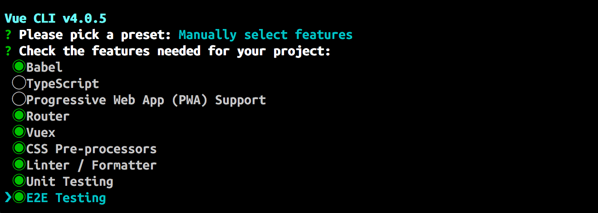
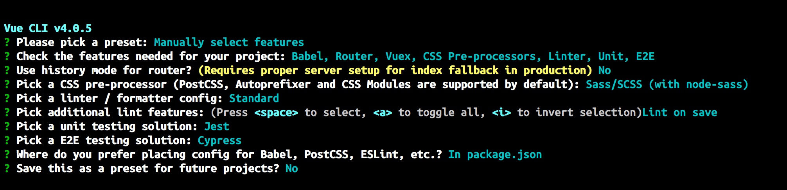
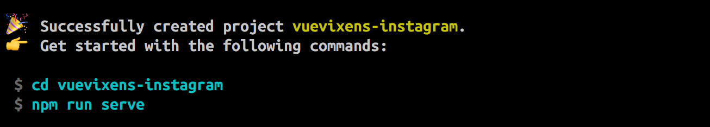
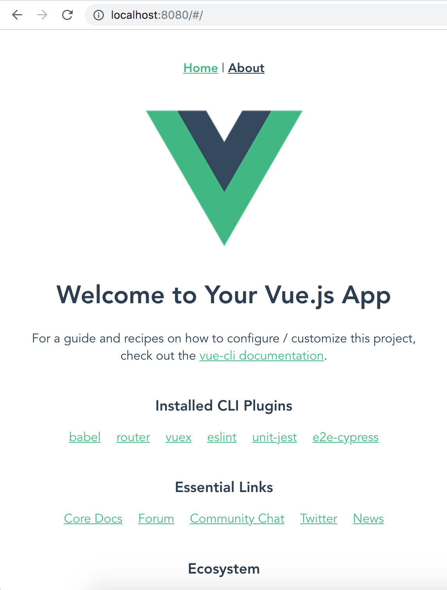
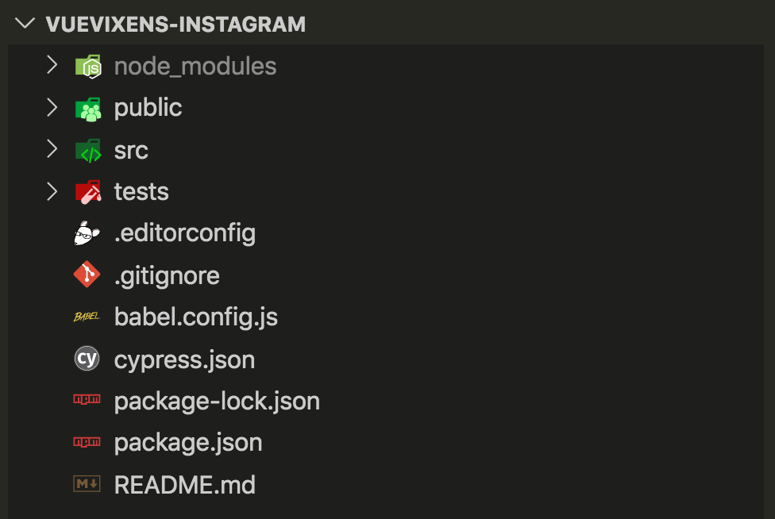
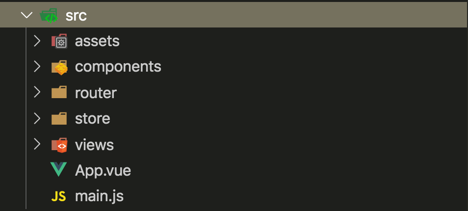
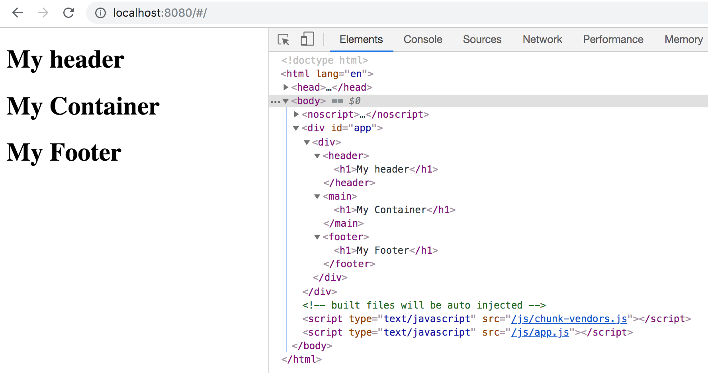
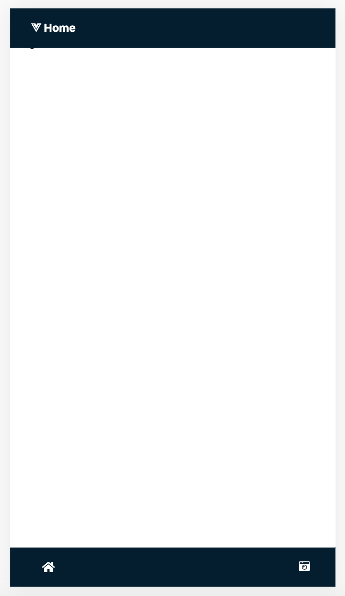

# 🙅 Mini workshop 2: Build an instagram application

| **Project Goal**            | Create your instagram site using Vue and other tools                                                                                                                                   |
| --------------------------- | ------------------------------------------------------------------------------------------------------------------------------------------------------------------------------------------------ |
| **What you’ll learn**       | Create an application from scratch with Vue. You will understand the base of Vue with this tutorial and at the end, you will have your first project with VueJS
| **Tools you’ll need**       | A modern browser like Chrome. Access to [Vue Developer tools](https://chrome.google.com/webstore/detail/vuejs-devtools/nhdogjmejiglipccpnnnanhbledajbpd?hl=en) extension for Chrome.
| **Time needed to complete** | 2 hours

# Start to build an instagram application

## Prepare your computer

1. Install **Node and npm**. Go to [Node Webiste](https://nodejs.org/es/download/) and download the install program and follow steps.
2. Install **vue cli dependency**. Put in your terminal and ```npm i -g @vue/cli```
3. Install some editor **[visual studio code](https://code.visualstudio.com/Download)**, **[sublime](https://www.sublimetext.com/3)** or **[atom](https://atom.io/)**.
4. Install some **recommended extensions**:

- [Vue Developer tools](https://chrome.google.com/webstore/detail/vuejs-devtools/nhdogjmejiglipccpnnnanhbledajbpd?hl=en)
- [Vetur](https://vuejs.github.io/vetur/)

Now, you can create the **project** with your terminal and start to coding.

```
vue create vuevixens-instagram
cd vuevixens-instagram
npm run serve
```

When you put it in your terminal you will find several steps to follow:

Pick Manually select feature


Pick some feature for your project: Babel, Router, Vuex, CSS Preprocessors, Linter, Unit Test, E2E Test...



Config your linters, preprocessors and some librarys...



Now, you can start. Put in your terminal: 

````
cd vuevixens-instagram
npm run serve
````



When it's ready on terminal you will see:

  - Local:   http://localhost:8080/
  - Network: http://192.168.1.134:8080/

If you enter on the followings links that appears in your terminal you can see your first application build with VueJS!



Congrats, you will see your first application build with VueJS!

## Take a look inside in your new project

If you open your new application with your favorite editor (Visual studio Code, Atom, Sublime or another one). You will see the following architecture of your new application.



Inside of this folder you will find the most important folder in your application: `/src` folder. Here you will find several files and folders:



- `/assets` The folder where you put your icons, images...
- `/components` The folder where you put your components. At the beginning you will find an example of component called: HelloWorld.vue Take a look!
- `/router` The folder where you define your routes. At the beginning you will find an `index.js` whith a starter router configuration.
- `/store` The folder where you define a global state for your application.
- `/views` The folder where you define the files for each page of your application.

And out of this folders you will find two files:

- `App.vue` Your main component.
- `main.js` Your main JS file. Where Vue is istanciated.

## Now, it's time to code.

- First at all, take a look inside on your file `App.vue`.

You only need to keep this file like this.

````
<template>
  <div id="app">
    <router-view/>
  </div>
</template>

<style lang="scss">
html,
body,
#app {
  margin: 0;
  font-family: "Roboto", sans-serif;
  font-size: 14px;
}
</style>
````

## Create your main components

For that you need to organize your project first:

- Create files that are **views** inside of a new folder: ```/views```

  > At the beginning you will find two files: `Home.vue` and `About.vue`. You can work with `Home.vue`

  - Inside of this file you can remove the reference of `HelloWorld` component.

- Create files that are **components** inside of a new folder: ```/components```

  > At the beginning you will find one file: `HelloWorld.vue` inside of this folder. You can take a look inside of this file and then you can delete it.

  - You will need to create three files inside of ```/components```:

    - TheHeader.vue
    - TheFooter.vue
    - TheContainer.vue

  - You can remove HelloWorld.vue component.

### Example of component

PAY ATTENTION: Inside of your components should have the following:

- One tag ```<template></template>``` for your HTML.
- One tag ```<script></script>``` for your Javascript.
- One tag ```<style></style>``` for your CSS.

```
<template>
  <div>
    <!-- YOUR HTML HERE -->
  </div>
</template>

<script>
export default {
  name: 'My Component'
}
</script>

<style scoped>
  main {
    margin: 20px;
    padding: 20px;
  }
</style>
```

- Inside or your tag ```<template></template>``` should be one tag container of everything. If you don't do that you will get an error.

- Inside or your tag ```<script></script>``` the most important thing is that you have the `export default {}` and the name attribute ```name: 'Main'```.

- If you want to style your component use ```<style></style>``` You can use ```scoped``` attribute when you want to wrap these styles inside of the component. If you want to apply this style in general, don't put this attribute.

## Architecture of your project

Until now, your project grows a little bit and it should has this structure.

```
src/
  assets/
  components/
    TheFooter.vue
    TheHeader.vue
    TheContainer.vue
  views/
    Home.vue
  App.vue
```

### Components:

And your components should look like:

  **TheFooter.vue**

  ```
    <template>
      <footer>
        <h1>My Footer</h1>
      </footer>
    </template>

    <script>
    export default {
      name: 'MyFooter'
    }
    </script>

    <style>

    </style>

  ```

  **TheHeader.vue**

  ```
    <template>
      <header>
        <h1>My header</h1>
      </header>
    </template>

    <script>
    export default {
      name: 'MyHeader'
    }
    </script>

    <style>

    </style>
  ```

  **TheContainer.vue**

  ```
    <template>
      <main>
        <h1>My Container</h1>
      </main>
    </template>

    <script>
    export default {
      name: 'MyContainer'
    }
    </script>

    <style>

    </style>
  ```

### Views:

  Now, in your page component ```Home.vue``` you need to import your components in JS and use it in your template (HTML). Like you can see here:

  **Home.vue**

    ```
    <template>
      <div>
        <the-header />
        <the-container />
        <the-footer />
      </div>
    </template>

    <script>
    import TheHeader from '@/components/TheHeader.vue'
    import TheContainer from '@/components/TheContainer.vue'
    import TheFooter from '@/components/TheFooter.vue'

    export default {
      name: 'Home',
      components: {
        TheHeader,
        TheContainer,
        TheFooter
      }
    }
    </script>
    ```

Now, if you refresh your browser you can see something like that:



## TheHeader:

It's time to make our application looks nice. We can start with `TheHeader.vue` component.

You will need to add 4 buttons into your header that should be show by step in the future.

````
<template>
  <header>
    <button>Home</button>
    <button>Cancel</button>
    <button>Next</button>
    <button>Share</button>
  </header>
</template>
````

Now, you want to add some methods to handle the differents events when the user makes click on it.
For that you can use the `@click` to control the click event, and then call the method that you will be create to handle this event.

````
<template>
  <header>
    <button @click="handleGoToHome">
      Home
    </button>
    <button @click="handleGoToHome">
      Cancel
    </button>
    <button @click="handleNextStep">
      Next
    </button>
    <button @click="handleSharePost">Share</button>
  </header>
</template>
````

For that, you will need to create a new node inside of your script called `methods`. And inside you can create the next three methods: `handleGoToHome`, `handleSharePost` and `handleNextStep`.

For each method you need to emit the name of event to catch the event in parent component.

````
<script>
export default {
  name: 'TheHeader',
  methods: {
    handleGoToHome() {
      this.$emit('go-to-home')
    },
    handleSharePost() {
      this.$emit('share-post')
    },
    handleNextStep() {
      this.$emit('next-step')
    }
  }
}
</script>
````

You will need to add some style inside of your `TheHeader.vue` component.


````
<style scoped lang="scss">
header {
  position: absolute;
  top: 0;
  left: 0;
  right: 0;
  height: 50px;
  background-color: #041e30;
  display: flex;
  flex-direction: row;
  justify-content: space-between;
  align-items: center;
  padding: 0 20px;
  z-index: 10;

  button {
    color: #ffffff;
    font-weight: bold;
    cursor: pointer;
  }
}
</style>
````

Now, we need to take control of a property called `step` that we take from outside.
For this, we need to add some directive from vue `v-if` that help us to show / hide the button depends of the property step.

````
<template>
  <header>
    <button v-if="step === 1" @click="handleGoToHome">
      Home
    </button>
    <button v-if="step === 2 || step === 3" @click="handleGoToHome">
      Cancel
    </button>
    <button v-if="step === 2" @click="handleNextStep">
      Next
    </button>
    <button v-if="step === 3" @click="handleSharePost">Share</button>
  </header>
</template>
````

As this props is from outside we need to define inside of props node in our `<script>`.
You can define with a value by default as a type:Number.

````
<script>
export default {
  props: {
    step: {
      type: Number,
      default: 1
    }
  },
}
</script>
````

If you got an error don't worry you have here the final state of this file to take a look and compare with your result:

````
<template>
  <header>
    <button v-if="step === 1" @click="handleGoToHome">
      Home
    </button>
    <button v-if="step === 2 || step === 3" @click="handleGoToHome">
      Cancel
    </button>
    <button v-if="step === 2" @click="handleNextStep">
      Next
    </button>
    <button v-if="step === 3" @click="handleSharePost">Share</button>
  </header>
</template>

<script>
export default {
  name: 'TheHeader',
  props: {
    step: {
      type: Number,
      default: 1
    }
  },
  methods: {
    handleGoToHome () {
      this.$emit('go-to-home')
    },
    handleSharePost () {
      this.$emit('share-post')
    },
    handleNextStep () {
      this.$emit('next-step')
    }
  }
}
</script>

<style scoped lang="scss">
header {
  position: absolute;
  top: 0;
  left: 0;
  right: 0;
  height: 50px;
  background-color: #041e30;
  display: flex;
  flex-direction: row;
  justify-content: space-between;
  align-items: center;
  padding: 0 20px;
  z-index: 10;

  button {
    color: #ffffff;
    font-weight: bold;
    background-color: transparent;
    border: 0px solid;
    font-size: 14px;
    -webkit-appearance: none;
  }
}
</style>
````

If you want you can add some icons from ***font-awesome*** to the `header.vue` and another places of your application.

````
<template>
  <header>
    <button v-if="step === 1" @click="handleGoToHome">
      <i class="fab fa-vuejs"></i> Home
    </button>
    <button v-if="step === 2 || step === 3" @click="handleGoToHome">
      <i class="fas fa-arrow-left"></i> Cancel
    </button>
    <button v-if="step === 2" @click="handleNextStep">
      Next <i class="fas fa-arrow-right"></i>
    </button>
    <button v-if="step === 3" @click="handleSharePost">Share</button>
  </header>
</template>
````

For use ***font-awesome*** icons you need to include inside of the `<head>` tag in your `index.html` this line:

````
<link rel="stylesheet" href="https://use.fontawesome.com/releases/v5.0.13/css/all.css">
````

## Home.vue:

With the changes that we did in `TheHeader.vue`, now we need to adapt the `Home.vue` component to catch the different events from the header and pass as props the `step` property.

First at all, we need to pay attention on the template.
Because we need to pass dynamically the property `step`.
And we need to catch the three emits from `TheHeader.vue`: `go-to-home`, `next-step`, `share-post`.
And then handle doing new things with our methods inside of our `Home.vue` component.

````
<template>
  <div>
    <the-header
      :step="step"
      @go-to-home="handleGoToHome"
      @next-step="step++"
      @share-post="handleSharePost"/>
    <the-container />
    <the-footer />
  </div>
</template>
````

Now, we need to create inside of `<script>` the node `methods` with the events: `handleGoToHome` and `handleSharePost` to handle the events from `Header.vue` component.

````
<script>
export default {
  methods: {
    handleGoToHome () {
      this.step = 1
    },
    handleSharePost () {
      this.handleGoToHome()
    }
  }
}
</script>
````

And we need to create the `data()` function with `step` property initialized to 1 too.

````
<script>
export default {
  data () {
    return {
      step: 1
    }
  }
}
</script>
````

If you have doubts until this point, no worries. This should be the final state of `Home.vue` in this point.

````
<template>
  <div>
    <the-header
      :step="step"
      @go-to-home="handleGoToHome"
      @next-step="step++"
      @share-post="handleSharePost"/>
    <the-container />
    <the-footer />
  </div>
</template>

<script>
import TheHeader from '@/components/TheHeader.vue'
import TheContainer from '@/components/TheContainer.vue'
import TheFooter from '@/components/TheFooter.vue'

export default {
  name: 'Home',
  data () {
    return {
      step: 1
    }
  },
  components: {
    TheHeader,
    TheContainer,
    TheFooter
  },
  methods: {
    handleGoToHome () {
      this.step = 1
    },
    handleSharePost () {
      this.handleGoToHome()
    }
  }
}
</script>
````

## TheFooter.vue:

In order to advance with our application, the next step is prepare to work our `TheFooter.vue` component.

First we need to add a button to allow the user come back to the home as we did in the header.

````
<template>
  <footer>
    <button @click="handleGoToHome">
      <i class="fas fa-home fa-lg"></i>
    </button>
  </footer>
</template>
````

Then we need to add a new element to allow user upload images. So we create a new `<input type="file' />` for it.

````
<template>
  <footer>
    <button @click="handleGoToHome">
      <i class="fas fa-home fa-lg"></i>
    </button>
    <div class="footer-upload">
      <input
        type="file"
        name="file"
        id="file"
        class="inputfile"
        :disabled="step !== 1"
        @change="handleUploadImage"
      />
      <label for="file">
        <i class="fas fa-camera-retro"></i>
      </label>
    </div>
  </footer>
</template>
````

As you can see on our `<template>` we need to create two new methods to `handleGoToHome` and `handleUploadImage` and emit the events properly.

````
<script>
export default {
  methods: {
    handleGoToHome () {
      this.$emit('go-to-home')
    },
    handleUploadImage (ev) {
      this.$emit('upload-image', ev)
    }
  }
}
</script>
````

And we need to receive the property step to disable the button when we are on a different step of first one. So we add as props, define by Number and with a default value.

````
<script>
export default {
  props: {
    step: {
      type: Number,
      default: 1
    }
  },
}
</script>
````

Now, feel free for add some style to the footer. We create that styles but feel free to change as you want.

````
<style scoped lang="scss">
footer {
  position: fixed;
  left: 0;
  right: 0;
  bottom: 0;
  height: 50px;
  background-color: #041e30;
  color: #ffffff;
  display: flex;
  flex-direction: row;
  align-items: center;
  justify-content: space-around;
  z-index: 10;

  .footer-upload {
    p {
      font-size: 0.63rem;
      position: absolute;
      left: -25px;
      top: 5px;
    }
  }

  input[name="file"] {
    visibility: hidden;
  }

  label {
    cursor: pointer;
    z-index: 99;
  }

  button {
    color: #ffffff;
  }
}
</style>
````

If you have doubts or you get an error, no worries. You have here the final state of `TheFooter.vue` component with all the changes tha we apply before.

````
<template>
  <footer>
    <button @click="handleGoToHome">
      <i class="fas fa-home fa-lg"></i>
    </button>
    <div class="footer-upload">
      <input
        type="file"
        name="file"
        id="file"
        class="inputfile"
        :disabled="step !== 1"
        @change="handleUploadImage"
      />
      <label for="file">
        <i class="fas fa-camera-retro"></i>
      </label>
    </div>
  </footer>
</template>

<script>
export default {
  name: 'TheFooter',
  props: {
    step: {
      type: Number,
      default: 1
    }
  },
  methods: {
    handleGoToHome () {
      this.$emit('go-to-home')
    },
    handleUploadImage (ev) {
      this.$emit('upload-image', ev)
    }
  }
}
</script>

<style scoped lang="scss">
footer {
  position: fixed;
  left: 0;
  right: 0;
  bottom: 0;
  height: 50px;
  background-color: #041e30;
  color: #ffffff;
  display: flex;
  flex-direction: row;
  align-items: center;
  justify-content: space-around;
  z-index: 10;

  .footer-upload {
    p {
      font-size: 0.63rem;
      position: absolute;
      left: -25px;
      top: 5px;
    }
  }

  input[name="file"] {
    visibility: hidden;
  }

  label {
    cursor: pointer;
    z-index: 99;
  }

  button {
    color: #ffffff;
  }
}
</style>
````

## Home.vue

Now, you have to adapt the `Home.vue` component with the information from `TheFooter.vue`

First, you need to pass the step property dinamically. `:step="step"`
And catch the events from this component: `@go-to-home="handleGoToHome"` and `@upload-image="handleUploadImage`

````
  <the-footer
    :step="step"
    @go-to-home="handleGoToHome"
    @upload-image="handleUploadImage"/>
````

Inside of `data()` function you need to manage the image value too.

````
data () {
  return {
    image: '',
    step: 1
  }
},
````

Inside of `handleGoToHome()` function you need to initialize the image value too.

````
methods: {
  handleGoToHome () {
    this.image = ''
    this.step = 1
  }
}
````

You need to create a new method called `handleUploadImage()` to manage the image that user upload.

````
methods: {
  handleUploadImage (ev) {
    const files = ev.target.files
    if (!files.length) return

    const reader = new FileReader()
    reader.readAsDataURL(files[0])
    reader.onload = ev => {
      this.image = ev.target.result
      this.step = 2
    }
    document.querySelector('#file').value = ''
  },
}
````

No worries if you have doubts until this point. This is the final state of `Home.vue` at this point.

````
<template>
  <div>
    <the-header
      :step="step"
      @go-to-home="handleGoToHome"
      @next-step="step++"
      @share-post="handleSharePost"/>
    <the-container />
    <the-footer
      :step="step"
      @go-to-home="handleGoToHome"
      @upload-image="handleUploadImage"/>
  </div>
</template>

<script>
import TheHeader from '@/components/TheHeader.vue'
import TheContainer from '@/components/TheContainer.vue'
import TheFooter from '@/components/TheFooter.vue'

export default {
  name: 'Home',
  data () {
    return {
      image: '',
      step: 1
    }
  },
  components: {
    TheHeader,
    TheContainer,
    TheFooter
  },
  methods: {
    handleGoToHome () {
      this.image = ''
      this.step = 1
    },
    handleUploadImage (ev) {
      const files = ev.target.files
      if (!files.length) return

      const reader = new FileReader()
      reader.readAsDataURL(files[0])
      reader.onload = ev => {
        this.image = ev.target.result
        this.step = 2
      }
      document.querySelector('#file').value = ''
    },
  }
}
</script>
````

Hoora!! Now, if you refresh your page you can see `TheHeader.vue` and `TheFooter.vue` works as expected.



## VueVixens Instagram

Now, you need to add several things to create you instagram application.

## Index.html

First at all you need to open your index.html and add inside of your `<head>` tag this css that you will need for your filters.

````
<link rel="stylesheet" href="https://cdnjs.cloudflare.com/ajax/libs/cssgram/0.1.10/cssgram.min.css">
````

## Posts.js

Now, you need to create a fake data of posts. For this you need to create a new folder called `/data` inside of `/src` folder and create a new file called `posts.js`. The array of information could be something like following code:

````
export default [
  {
    username: 'groot',
    userImage: 'https://avatarfiles.alphacoders.com/185/185637.jpg',
    postImage:
      'https://img.europapress.es/fotoweb/fotonoticia_20170729113807_640.jpg',
    likes: 1200,
    hasBeenLiked: false,
    caption: 'Ready to destroy the galaxy!',
    filter: 'perpetua'
  },
  {
    username: 'rocket',
    userImage: 'https://www.elcomercio.com/files/article_main/uploads/2019/02/08/5c5df92fccbed.jpeg',
    postImage:
      'https://cdne.diariocorreo.pe/thumbs/uploads/img/2019/06/03/guardianes-de-la-galaxia-vol-3-explicara-el-origen-890614-837600-jpg_604x0.jpg',
    likes: 600,
    hasBeenLiked: false,
    caption: 'Ready to destroy the galaxy!',
    filter: 'clarendon'
  },
  {
    username: 'gamora',
    userImage: 'https://img.ecartelera.com/noticias/54000/54027-c.jpg',
    postImage:
      'https://images.alphacoders.com/691/thumb-1920-691565.jpg',
    likes: 800,
    hasBeenLiked: false,
    caption: 'Ready to destroy the galaxy!',
    filter: 'lofi'
  },
  {
    username: 'star lord',
    userImage: 'https://www.psicocine.com/wp-content/uploads/2014/05/star-lord-guardianes-de-la-galaxia.jpeg',
    postImage:
      'https://sm.ign.com/ign_latam/news/r/rumor-guar/rumor-guardians-of-the-galaxy-ride-taking-over-dis_991u.jpg',
    likes: 300,
    hasBeenLiked: false,
    caption: 'Ready to destroy the galaxy!',
    filter: 'moon'
  }
]

````

## Filters.js

Inside of `/data` folder you will need to create a new file called `filters.js` where you create a new array of filters to images.

````
export default [
  { name: 'normal' },
  { name: 'clarendon' },
  { name: 'gingham' },
  { name: 'moon' },
  { name: 'lark' },
  { name: 'reyes' },
  { name: 'juno' },
  { name: 'slumber' },
  { name: 'aden' },
  { name: 'perpetua' },
  { name: 'mayfair' },
  { name: 'rise' },
  { name: 'hudson' },
  { name: 'valencia' },
  { name: 'xpro2' },
  { name: 'willow' },
  { name: 'lofi' },
  { name: 'inkwell' },
  { name: 'nashville' }
]
````

## CardPost.vue

Then you need to create a new component to create a card with the information for each post inside of `/components` folder called `CardPost.vue`.

This is the `<template>` for this component:

````
<template>
  <article class="card-post">
    <div class="header level">
      <div class="level-left">
        <figure class="image is-32x32">
          
        </figure>
        <span class="username">{{post.username}}</span>
      </div>
    </div>
    <div class="image-container"
      :class="post.filter"
      :style="{ backgroundImage: 'url(' + post.postImage + ')' }"
      @dblclick="like">
    </div>
    <div class="content">
      <div class="heart">
          <button @click="like" aria-label="You like">
            <i class="far fa-heart fa-lg" :class="{'fas': this.post.hasBeenLiked}"></i>
          </button>
      </div>
      <p class="likes">{{post.likes}} likes</p>
      <p class="caption"><span>{{post.username}}</span> {{post.caption}}</p>
    </div>
  </article>
</template>
````

This is the `<script>` for this component:

````
<script>
export default {
  name: 'cardPost',
  props: {
    post: Object
  },
  methods: {
    like () {
      this.post.hasBeenLiked ? this.post.likes-- : this.post.likes++
      this.post.hasBeenLiked = !this.post.hasBeenLiked
    }
  }
}
</script>
````

This is the `<style>` for this component:

````
<style lang="scss">
.card-post {
  padding-top: 50px;
}

.card-post ~ .card-post {
  padding-top: 0;
}

.card-post {
  padding: 5px 0;

  .header {
    height: 30px;
    border-bottom: 1px solid #fff;
    margin: 7.5px 10px;

    .level-left {
      display: flex;
      flex-direction: row;
      align-items: center;
    }

    .image {
      display: inline-block;
      margin: 0;
    }

    figure,
    img {
      border-radius: 100%;
      height: 32px;
      width: 32px;
    }

    .username {
      position: relative;
      padding-left: 5px;
      font-size: 0.9rem;
      font-weight: bold;
    }
  }

  .level {
    margin-bottom: 0.5rem !important;
  }

  .image-container {
    height: 330px;
    background-repeat: no-repeat;
    background-position: center center;
    background-size: cover;
  }

  .content {
    margin: 7.5px 10px;
  }

  .heart button {
    border: 0 solid;
    padding: 0;
  }

  .far.fa-heart,
  .fas.fa-heart {
    cursor: pointer;
  }

  .fas.fa-heart {
    color: #f06595;
  }

  .likes {
    margin: 5px 0;
    margin-bottom: 5px !important;
    font-size: 0.85rem;
    font-weight: bold;
  }

  .caption {
    font-size: 0.85rem;

    span {
      font-weight: bold;
    }
  }
}

.card-post:last-child {
  margin-bottom: 50px;
}
</style>
````

## CardFilter.vue

Then you need to create a new component to create a card filter with the information for each filter inside of `/components` folder called `CardFilter.vue`.

This is the `<template>` for this component:

````
<template>
  <div class="card-filter">
    <p>{{filter.name}}</p>
    <div class="img"
      :class="filter.name"
      :id="filter.name"
      :style="{ backgroundImage: 'url(' + image + ')' }"
      @click="selectFilter">
    </div>
  </div>
</template>
````

This is the `<script>` for this component:

````
<script>
export default {
  name: 'CardFilter',
  props: {
    filter: Object,
    image: String
  },
  methods: {
    selectFilter (ev) {
      ev.preventDefault()
      this.$emit('filter-selected', { filter: ev.target.id })
    }
  }
}
</script>
````

This is the `<style>` for this component:

````
<style lang="scss">
.card-filter {
  display: inline-block;
  margin: 0 3px;
  box-sizing: border-box;
  p {
    font-size: 11px;
    text-align: center;
    text-transform: capitalize;
    padding-bottom: 5px;
  }
  .img {
    cursor: pointer;
    height: 100px;
    background-size: cover;
    background-position: center center;
  }
}
.card-filter:last-child {
  margin-right: 20px;
}
</style>
````

## TheContainer.vue

Now you need to include these components in `TheContainer.vue` component.

This is the first part for the `<template>` divide by steps:

````
<template>
  <main>
    <div v-if="step === 1" class="feed">
      <card-post v-for="post in posts"
        :post="post"
        :key="posts.indexOf(post)">
      </card-post>
    </div>
    <div v-if="step === 2">
      <div class="selected-image"
          :class="selectedFilter"
          :style="{ backgroundImage: 'url(' + image + ')' }"></div>
      <div class="filter-container">
        <card-filter v-for="filter in filters"
          :filter="filter"
          :image="image"
          :key="filters.indexOf(filter)"
          @filter-selected="handleFilterSelected">
        </card-filter>
      </div>
    </div>
    <div v-if="step === 3">
      <div class="selected-image"
        :class="selectedFilter"
        :style="{ backgroundImage: 'url(' + image + ')' }"></div>
      <div class="caption-container">
        <textarea class="caption-input"
          placeholder="Write a caption..."
          type="text"
          :value="value"
          @input="$emit('input', $event.target.value)">
        </textarea>
      </div>
    </div>
  </main>
</template>
````

This is the `<script>` part for this component:

````
<script>
import CardPost from './CardPost'
import CardFilter from './CardFilter'

export default {
  name: 'TheContainer',
  data () {
    return {
      selectedFilter: ''
    }
  },
  props: {
    step: Number,
    posts: Array,
    filters: Array,
    image: String,
    value: String
  },
  components: {
    CardPost,
    CardFilter
  },
  methods: {
    handleFilterSelected (ev) {
      this.selectedFilter = ev.filter
      this.$emit('filter-selected', { filter: ev.filter })
    }
  }
}
</script>
````

And this is the `<style>` part for this component:

````
<style lang="scss">
main {
  overflow: auto;
  height: calc(100vh);
  width: 100vw;
}

.caption-container {
  height: 210px;
  display: flex;
  align-items: center;
  justify-content: center;

  textarea {
    border: 0;
    font-size: 1rem;
    padding: 10px;
    border-bottom: 1px solid #eeeeee;
  }

  textarea:focus {
    outline: 0;
  }
}

.selected-image {
  background-repeat: no-repeat;
  background-size: cover;
  background-position: center center;
  height: 330px;
}

.filter-container {
  display: grid;
  grid-template-columns: auto auto auto auto;
  padding: 30px 10px;
}

.feed {
  height: 100%;
  overflow-y: scroll;
  overflow-x: hidden;
  padding: 50px 0;
}
</style>
````

## Home.vue

You just need to apply some changes in `Home.vue` component for all works as expected:

First, you need to configure `<the-container />` commponent with all the information that expected to be received and the method that you need to catch called `@filter-selected`

````
<the-container
  :step="step"
  :posts="posts"
  :filters="filters"
  :image="image"
  v-model="caption"
  @filter-selected="handleFilterSelected"
/>
````

Then, you need to import the data that you pass to `the-container` component:

````
import posts from '@/data/posts'
import filters from '@/data/filters'
````

And called inside of `data()` function to get the information:

````
  data () {
    return {
      posts,
      filters,
      caption: '',
      image: '',
      step: 1
    }
  },
````

Then you need to apply some changes of the methods that you created before:

````
methods: {
  handleGoToHome () {
    this.caption = ''
    this.image = ''
    this.step = 1
  },
  handleSharePost () {
    const post = {
      username: 'VueVixens',
      userImage:
        'data:image/png;base64,iVBORw0KGgoAAAANSUhEUgAAAN8AAADiCAMAAAD5w+JtAAABgFBMVEX///9NuoftclFDVGb57t6ZRDP/8OJBQEJGvIbF59fxb09JuYU/vYnBjGVNvYj58eFCTWRDUWU7t4H69eVOwImTQTFCTGRCSWPsZ0Lsa0jsZkAzUmc2toD++vjl5tLa4sz45dT87OhMr4NMtYWCx554xZqXzan3u6399vHteFj1zrtEYWrb8OZDV2fy69lKoH7p9vDI3MLjbU3xpIzugmTvkHUtLjO3bFtGd3BHhnXM6tuv38dFbW1qwZS21rjM3sWe2bxIkHj4rpz84dq+WEDwmoDvjHD21sTugGLUy77ytJ46R1a3saihnZeK0q9Km3yj0K75xLj608rPYUarTjn3vrHBWkLhvLTjrJ/fl4brWzDejXjheV+/ZUyySSvLr5+nbFq2inphXl2MhoBwa2kcHScKDh3JwbUgIilQTUyspZvY19aXTzqXORvYfVW8f2CNXFJ2QzmfjIOJVEghMUIrPlEAHTViY2iDZV1gSEeneGsuO0BSQ0FxSD+PTTyJZmHiTsvdAAATu0lEQVR4nN1ci3/TRraObUVJpb0RkUiQjGM7YBs7gBqTR1ta25DgPBxonQfdR7dtKNmysNy77eXVvb3t/us7M9JII3ukGT1sy/l+v/YHxBrPp3PmfGfOnMnMzFixuhPygZWNkcxjRFht6PVwTxznu6OZyihQ35SMcAZc2czqYU0+OWwZ2ay0GuaJY/CE/nRU80kYO3oW8Avjb3UJPJHN745sSkniBNID5jjhf6RroEeMkIt2IljN2mis8D5ykreekLZGObGEsCXZ/AxeD11p4FcyBUvwWMeTzeaP+R6xvRNZMFRUmgDqUpYA12yJN8Jv80lhxyDoSXscT6yST2T1dMfQVZ2cbJZH5Q88T2Q3Rz/JGNgwvLPNM0WiG/qJCWJVyg7AYCzBY33wCR6fnhRuYWOcOktwM1AFd90Xcg+/kfSuwBVnLS05BI2gjU/dUb7s2VmINTshnGBn+3ppCZsjqweooJMLkE80UpulOdFlFsCxjH/I7zmL797S7NIj/Pm0RpgVPNvTpdnZpTOHoF8ieuLGllnijQR69CSxm8drCc6WWIL0pMRJxMEDS+QDB9yJ+XjhRM8lZA5iCVLTZnfxPbIewBbXU5qE7hHuOetZgrSYf8vxzsHPGyldgNh8j/B83SW4uXtycnx8fAvi6fHxCYAbW+xPOwZPqUKsepYfmvDXDkFJMjyQXGF3P44XYDq3ubvYIrOzQzMOgGNtVyEak6ZCxR9tfvfwhJeWCA/1A/BOh6ATYCZNhYo/GSQ/QO4Rh/Xg50/P4KeJAJNPZQbzZ5sfCIeQ3D1fQhRYFJcwv1QKxJ8lzO/s61DkbDM+cvilUwC/sfndi0DOfhLzS+EWqb4xtLeNAc7K2/iwemCwZ80Po5uuHHRXT9J6kGDwvn/M2E2YHSSYojoMUWZIkGB6toGDVcFkMNp9/MpKvb4qivV6XRRXVwD8P+rsaxPGqPa5gJkoKIqgaJqG/tu/1W1kN7u3Tlap37iV/OpDCKpMxeGmAAgWFKW81m3oOnRAsMORNjeOh3KL+ojMx3d8EQqAm+ZwEwRNON7K6p7FJQGOO9704mSoBJ0UwjZhBGOlrhDcgOn2NySqaQy9QVJMNHHx8kswwkB2AslubSvvHxYNfe8Yv9zNUdHLGoktwBVxkN3BX/K6HpSV6NkdaymOQvxsfrdGwk4Qyr2d3tra2tNet5H3jx6G1N0lT8/Tyq8ueNkhA1rQlPLTA//4Ielbu+sHvj+OzS+JdgNgvEF2Xqra2qb/QpT0b/46Mn5JxJe6EkAPGRAgKAG7N0J+sfe5gcYDiUuvu5k1jOD08ttR6Z/0l7gJWt2fHchcNhp5nm3dJ71NI0BKIsLIZ7diykOA8YBA7PHO+TtTK69tbBrJbXENPbvX2xe0eOnLir/xtLU9/tmefg9TcaXc20qEIsiONtbKKJWK5Z7+1tPKW6Emeq7Zy7X8lNvofsgb3TXBDnlKHHr+S0/pGeHM8OjQeVQrb0gxGOYPnoLXhEeL456+9JTyXtj9zr1nxGCa0MtGZKhvrmlkgh/DPX3paWsRZndW9rwhYSekAyAYjTWvFJsx6Pn5ptbTDT2f18NN8PSZ93Vp4X0gm98YzBKju6cvPaGr7230nh73droHYTTtbGAYReuFI2hk97XBuSRPT1nbVzQN5dWaJuwD3eajqK8Nubu2nw3hAsbWcIofWR0CkxaPEbRyl2t2G5QRlTJ/xV6nDSBoidPzkhPK+8c9ns1dgz6CELDt8CC/MeSb0QkGZC3u1BSQcO1l9bzOM8P8vt+QfAT1HTo9QYkQYVZ4yPU2df7gYvi8fYgDjjUY8HyEBIZlPUXZ7xqhNjx077QGK3PQ2wraoYWlx96r73H5pAtK7LRGUjQYkNmvCvEQ6TYMm8IwYou2H1qXJfrrFx//8PK5ifIFxusBi1c5vHh5cUgdJ5wBgxefUu6Gr7QbZeq8nv9tbm57GxLcC1yCeg/Qe/zj3Nzcj49F2kChQkyg9ZSnETJPo0dzLOXF9hzEBfjCchA/ZH0TfXZumz6rEB5KfUF4HGErUhmFvvieW/zm4J9vBYxrwMTcfhnbh7ShQngosfigeltFTvRn4CP7kTY1eZ/g8sTlJyj+Hmr0FCY/7jTNEnaQWgpafbVeX3FQr4swWzTCb2qkPR+PP0RT3n4Of6zs+765huXcc+7LiGHAOjSVCIhRya+snuxsSiEpGsNJPzbg37fntl+a1gT9qqfY+i+2wYe36QEUzJkvxKwoikjn5mL1eItzx2Dj/PuyQqWovHh+8cr5G30FSlv2o+Lh84snVHpgcPPFP7j4MclhigchakunZ7OQInVqihPOlB71pelu3qrQhgDkDp+9Pvsm6Wa03S6MNRIfsqff/ffr7/cp2zcSNHpGN1iuhP1ns9+dZqV8QodkBFZ3pP/5Lyb++YmNn37++ZdXhwEUqQY0fLcdkNzh//7285tzNPzjf3zERliG3/+BjesYudzR27cfnpia34wpebaz+oYA3PL50dt3uVzOGn35q3kW1AehbfhAzjCw8HA5RwBSfOxDUdsZMqBON5+iHD45ev+OHPj2VdZM5ExoejMzC6xRMwu3F3MeHL1/e/HCpM27PMRvj5rYma8+vH/rHfTaDeZM1LDuCfGRyuT38ZXcIN69P3pOWYpadyAoUzIfxXx88fbt0cCAi5+yzVeNQG9mpsX20C8Whwjmjt69fTm0FJX9ga1JY4Ae8Euw6AbJAVy5yZpFZv5OJH53mAbM3FgenhBaiu8/vPAaUfOe0us9z08VEyy6o9zd4aGWP2N6p/xlJHozM1/Os4a++tmwhzpL0ZORDOzkJU9FX3syuOgc3GbTm1+PyG99ge2hFAd1jOhNufy1XXnlxy535SuHn583qZ9HpAc0gmnAha+uBRAkQ6lCZtmeoo32+J3fEItfuPT6Lbr5WpHpcWkELcRggkcEQWWfcFCy5qb40wPagFlkimKTakH1fgx+0TSCJEjwcPvUDCK6KI99nZPQBtkUSyieywNLJnJwscDWiKuf+hvQQ5BIQvUyF73comOkttgpgKmorVrFw1COqA0Yd5grMHMzgJ+HoJvDbDq5i/IigN7yQ7w+CoJg0RREsUiuQ/lBLHrxNGKAoLY35J6B9BZvu18iFlW0BkVTFIrEopmPSQ9oBNOAVymyTCPoOGi+zEMvt/yx+92iUFErgmhWCi1TrDr/HEMbMD5na8TH/hoBCb7EBMt5b2odTG/xCzfxLJREwRTFEhDBQkes4BUYSxswIqahpAWxg1oRVL+lcNDLLROJJ3JNoS1bVJ0ZzcfRBoz7bI3wSUMHLWiXeg3LPZXDQHpXPiP3DbJcraAMRq2KZgH/YzxtwKiwNeKzQAPmjn6wHRTxs4qmDHq5uwMLH8mCrFYF1z0XoiaeXqzPMwneDJwq2BX+4kq8FT1Z9JadxFNWVdWegHyzKYpt7E+xtQEjdKmCYsFzJ4KiuhKL3qKzb1CrnVKzUrCnIAp9h95CQvRm1ln0WBoB8K9zKweVpANEzz/ntMyHixJyVYQoVhFDtX/TiQaRihJ0xNaIXO767+dgw/vi9zdv/u9QUMpzwZ/2JJ5mEwRPsdNC4cX5xohFCTo40tBgjcjlfnh0rv3w918BfnxVfnOdwQ9rg1wRTbWgViDDtmcLGDPx9IKnVMHgd/2Ts2f2QdHFtwxvXn7omK8m1mQYPPtA3s0aYb5ktAHjSw6NCEpDAT5kz978ivid/cQwn6sNhZqt5mqmDUxYwtKXlDZgrLP3ERmGUa6fS69/A+x+/b3BoHfNSTzVdkWsYKqtkit98/ETTy8+Z2cxAaUKyyqNe6//f+7X37IXwZ9zixJyXxSEtpOuFJJNPL2gVz9IXL3NMOAv0unv//rt9FuG+a44BWsZmEwQOi2HIf6qWEUJOj5ie+gNlkb8VXr0+uvsB4b5iIK1jCKn0Fa9yz9RbcCoxitVQHyQslnpnKUNXiqFPtizCzWSYfSKZxA4NOJm8MyBRkjZBiMMXXs4kFiDyAkYlqru188/GAE9Ho1YeMjQiLsN6d8sbXC8Uy6oBbjyZBUsQyKvTlobMDhKFQssjfiJXxsKlVKx1EaxBUROk9CG5BJPLzg0gpWG5riDi9pEibXYzFgbv9oItQEjgTSUgUVcsFb7IB1rVZoCrka42pBk4unF/fgaEYwrzmkY2DeADYPaIpad/YNkE08v2BqxwEpDg+HQq6Jcs1AUoOFarvUyI9EGjHWVSTATg901tyhREZuFjAp2Dyr6s2PExBNPLzhOzFga4Y9Ft1NCtspkqFYN9kj9MQQXCzxdFVH5Ld9wRwHrr1Zoi3BBqB23Yj0ybcDgOTGLGGIWPyVeHoifQl/oFKyK59jMl0ga6sfPKVjbdWpRrMDahCg62qeOMrhYuMNRDWUUC+m48tDd1aJSUkcURLNoim50GVHi6QVHGhpJI+4SsRPlYmoNVpVEsz/qxNOLBEoVNJBFCbGIdrQgsa7VKm7VLIHTMB7wlCpCeyh5GgZjp52UycRp9BiCiwW2/RgnZhR4tKHiRkwCiZyG8YBDI8Kmod7TMBA7+yownWptAG3Wo0w8vUheI+462lCAkAWzWq3V+v122xlyDNqAwaERmVAhlNCGZhHCFKzdn9gfqzZgJHBi5oFzGgZyTQRBKJYAmm33i8ZIjycNzQw29wYAtuiqSAfkGlCESrVVARIBVp86itMwHvCUKrgNCLVBLlmuKKtIE9SS65nIruPSBowkSxWwRbeK+nacQeWWKBKb2mRPw3jA7qrI3OAMMZY2FIWarLrNZSD7bE5EGzASODGzgbQBEJPBprbonLQDA7oyNNKiBB0c1VA+jUCdEi3o76gk2MlYZis03W3RWLUBg0MjWCdmECjxVDuojlSwzqFtJy06x0bjDi4WOLqzOTQCtujKGbDTQ0xU+xxaJgqe49YGjJjNvRauoIK1XBXEIjKbfQ5ddWPLaE7DeBCzudfiZyWesApRst6XdZrScQcfuzZg8DT3MgzotOhCgh3bIeBpClESHL82YMRt7iXasGCnhKN4YBkWHXqJtWGFB88FkGDvJFp01T4InXjZqa7Qj6coQQdH41aQRpBFCYtgfzBmTUgbMDKx0lB0fcPpfswUQOisDRAcQadEGMRKQ1HiqXb6VcwREqx4RpxgcLEQp1QBOyWgU4pmqV3JqCDzVAFBopEABJfxJ55exNAIpA1yv2RaO/Yi4FgAFhQIWZ1I4ukF+8TsKr1UYWsD2KS3as2iVW8pNqsd0XRbpSaoDRiRL4AQ2iAXCplqv4NICkQD+YQSTy8iNvcO3huWQYxp1drAW3EaM2ltwGB33tHK2ddo94YByYx7+2ZiiacXPM29QyHGW7D2cHR2tZPWBgyeUsWgAQevb1AwcW3A4LgAMthV4V7f8MWIOyXC4AF7p/vQE2KIe8P+mDQrAhxpqKerYnlEv1NiVAjZ3Etc30DHYJS3M7GiBB0clwSJNNTtlMi0i2axWSkMfjruveGkcWdohkNw7yG71zfQtUVYbRkUw8TuhiWFMOVspw2r0IG32lttwRz6dFq0AYOnnG2noU6nhJxB5+xgi1SB1XnyOCU92oDB3dxLXN+ooe7OmwKsVLdqbp6XksTTC45qKCpnOy268HoK4Kc2xZa3SXDSRQk6ODWCTDwrsKbbQv1XYOdeS0HFMwg8pQoQYoi/y4JYgy260GSme545gdMwHqzzXAC5RiaewGhCG9UEC3337lsKihJ08DT33vVsi1R4f6qSUYFEiE54SWNwscAuZ2dueP8KgouAfvWCW/gceYtudLA1woFctUue1RK8P+VeL0qlNmCwNQKzyOAzPlm9Wa223BR7hNc34uM+x07XYtFGV2+Q0TxNkKkpStDBTkMxQXjGJ/SHtkapKUrQwdPcaxNEv2zIrHgZTvQ0jAdsjXC5ZGA/SKlFnjekObhY4KYHGVbR7Vq3ujG2Ft3oYHdVACu5V76bAtH/n7KiBB1BaagVKFuuU8K7AO7mfYwtutER0NwrZyp2G5aAf1lGC2TYE23DCg9/jZDb6DamDK98m4iXXB39veGk4a8RsimiPjMrcharBbXQIS4XpV0bMHzTULlliqZ1ewo1KRXb4P/uDyc9b274npjJVUEoWn+yegXJBvn0awOG/z1ktQoUHd+9qZXMorMtSmlRgg7/EIMa6XAbVkEl9g3TEVws3PHf6UKCzeFq99QEFwsBaahaE4cutUf7DeuTxFA5u+Be1agN95ml6jSMB4MaUWi2q4CjVZPoD/aZTUXi6YW3VIHuFcEWpRYMKZAg2WeWttMwHng779R+x7oSJhSbtZYMCRJ9ZlOlDRhejbC6d4qYY6UpCsT1jUnPNQqGmntlWUVtWKZ1AU6s4Rg7ZdqAQb8AAq+cVmAbVmnC1zfig0bPNaQTgFJ5GsaDwFKFexVuGoOLBa5ydkpPw3jA0dybvk6JMGCXsyd5fSM+1pmNW1OqDRis5t6p1QYMRoiZwsTTi+ALIFOsDRiB5ewpqXgGIai5d0oK1sEIKFVMtTZg+GvE1BUl6PBr3JrCogQdPhox9dqAQb8AcimCiwV6Gjr92oBB04gUtuhGB+3EbNJzShRDIWZqixJ0DGrEpdEGDG8aOo0F62B4NWKqixJ0eH9XxaRnkzzICyApbtGNDlcjpr4oQYejEYXLFlws4K6KS1CUoMNOQy9BUYIOq3HrUiWeXqBSxeUMLhYyl6YoQcdH85cu8fSiWriswcXC/VFpw38A5BDAkI2eM5oAAAAASUVORK5CYII=',
      postImage: this.image,
      likes: 0,
      caption: this.caption,
      filter: this.filterType
    }
    this.posts.unshift(post)
    this.handleGoToHome()
  },
  handleUploadImage (ev) {
    const files = ev.target.files
    if (!files.length) return

    const reader = new FileReader()
    reader.readAsDataURL(files[0])
    reader.onload = ev => {
      this.image = ev.target.result
      this.step = 2
    }
    document.querySelector('#file').value = ''
  },
  handleFilterSelected (ev) {
    this.filterType = ev.filter
  }
}
````

And it's all. You have finished this tutorial, congratulations!!

## Author

Made with ❤️ by [Cristina Ponce](https://twitter.com/cristinagrim)

If you want to see this repository, you have here the link to [Github](https://github.com/crisgrim/vuevixens-instagram)